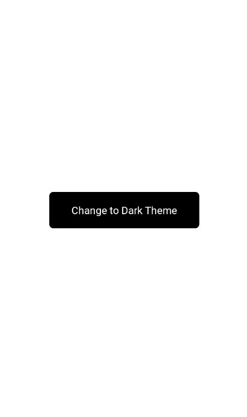

<h1 align="center">
  Trocar Tema | Light\Dark
   
</h1>

  

## 🌐 Tecnologias Usadas
Foram usadas essa tecnologias:

- [React Native](https://reactnative.dev/)
- [Yarn](https://yarnpkg.com/)
- [Expo](https://expo.io/)
 _
- [redux](https://redux.js.org/introduction/getting-started)
- [react-redux](https://react-redux.js.org/introduction/quick-start)
- [redux-thunk](https://www.npmjs.com/package/redux-thunk)
- [styled-components](https://styled-components.com/docs/basics)

## ***</>*** Como usar o código?
1. Instale o **Yarn** em seu computador
1. Instale o **NodeJs**
1. Clone este repositório `git clone https://github.com/JhonatanBergmann/buttonChange-themeApp.git`

### 📱 Mobile
1. Instale o **Expo** em seu celular.
1. Instale o **Expo CLI** com o comando `yarn global add expo-cli`
1. Acesse a pasta *mobile* e dê o comando `yarn install`
1. Acesse novamente a pasta *mobile* e dê o comando `yarn start`
1. Será aberto uma página no navegador com um *QR CODE*, leia-o com o aplicativo do **Expo**

## 📝 Licença

Esse projeto está sob a licença MIT. Veja o arquivo [LICENSE](LICENSE) para mais detalhes.

---

 Feito com 💜 by Jhonatan Bergmann

